# Native architecture

Logchat is a local hybrid RAG context service. Adapters extend how it receives events; they do not replace the shared memory system.

```mermaid
flowchart LR
  F[File / wrapped app / Docker / Railway / Vercel / CLI / push] --> N[Normalize events]
  N --> G[Shared local model: group]
  G --> C[Shared local model: compact summary and selected fields]
  C --> Q[Durable compact jobs]
  Q --> E[Embedding capability]
  E --> S[SQLite readable chunks + sqlite-vec + FTS]
  A[Agent query and scope] --> R[Scoped vector and lexical retrieval]
  S --> R
  R --> M[Shared local model: relevance selection]
  M --> O[Context, supporting memories, provenance and gaps]
  O --> A
```

Generation uses one model profile across grouping, summary and relevance roles. Embeddings are a separate capability with a digest/dimension-bound index. Original message bodies are transient in summary-only intake. Explicit temporary capture uses a bounded protected spool outside retrieval, then clears originals after durable compact acceptance or expiry.

Provider observation cursors and file positions identify what an adapter has accepted. The scheduler tracks durable jobs and indexing separately. A captured window does not establish complete coverage; a successful source connection does not establish that retrieval is ready. Invalid output and failed model calls retain gaps and do not publish candidates as selected evidence.

Readable memory contains model-written compact text, selected original values, scope, timestamps, exact measurements and loss notes. Code validates selected values and membership; prose itself is an unverified model interpretation. Native vector search uses exact eligible-vector cosine similarity, with lexical candidates combined by reciprocal rank fusion. Ranking is not calibrated confidence.

Output is retrieved context, not generated solutions. The read-only project-bound MCP lets the requesting agent inspect supporting memories. Source and settings changes are local authenticated control operations. Provider credentials live separately from event memory, and token values are never in source status.

Long-term consolidation, year-scale retention quality, hosted model setup, external legacy-history migration and broad live-provider acceptance remain separate work. The older Docker/pgvector stack is retained but does not back this native pipeline.

## Repository boundaries

`src/logchat/rag` is the active semantic core, `src/logchat/local` owns service/setup/capture, and `src/cli/native.py` is the public CLI. Shared transports and contracts live under `src/connectors` and `src/pipeline`. Compatibility API/CLI modules remain for shared client contracts and regression coverage. Earlier deployment assets are preserved on the `archive/legacy-stack` branch.

A fresh installation must select a generation model, embedding model and dimension. No named model is bundled, downloaded or selected by default. Existing index identity is retained when changing generation models.
