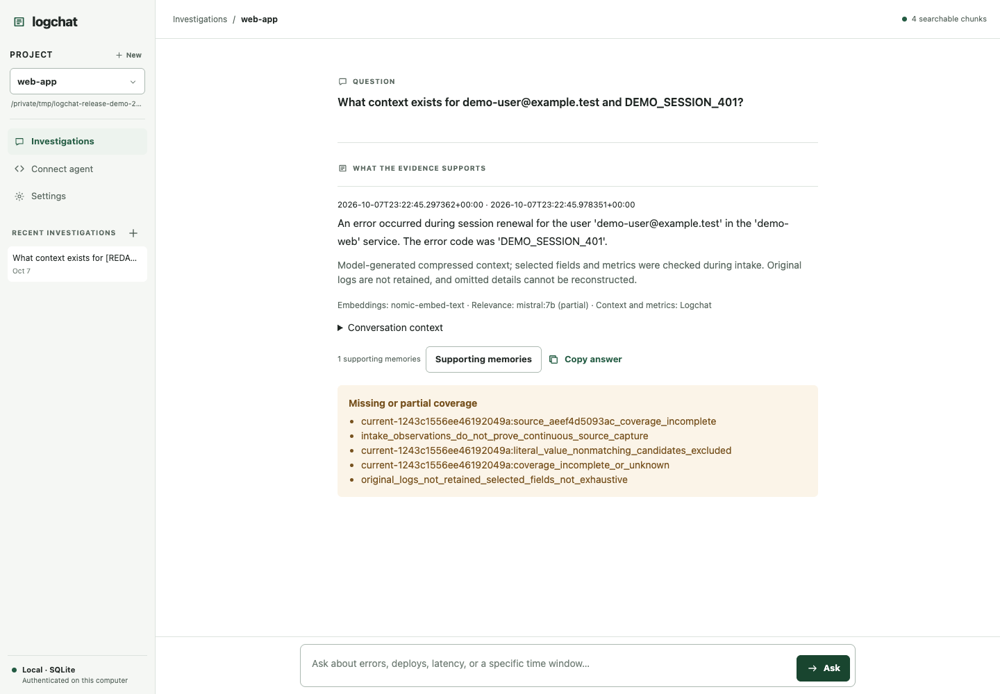
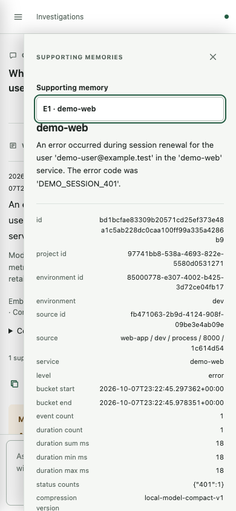

# Release verification — 2026-10-07

Target: **0.3.0rc11**, the scoped local native release candidate. Verification uses a fresh source export, dedicated Python environments and an installed wheel launched outside the checkout. This is local pre-release evidence, not a clean-machine or live-cloud certification. The scoped local acceptance gates below passed. Public-repository CI and live cloud-provider acceptance remain separate gates.

## Verified results

| Gate | Result | What it establishes |
| --- | --- | --- |
| Native regression suite | **624 passed, 177 subtests passed; 1 opt-in skip** | Synthetic contracts for intake, storage, auth, isolation, retry, settings, adapters and RAG stages; two non-blocking Typer/Click deprecation warnings |
| Opt-in real embedding evaluation | **1 passed separately** | The small labeled Ollama/sqlite-vec fixture; not a broad ranking-quality benchmark |
| Installed CLI/provider contracts | **28 passed, 0 failed** | Actual installed help plus mocked provider subprocess/error/window contracts |
| Installed actual Chrome | **20 passed, 0 failed** | Real button-triggered browser intake, dev/preview/prod scoped queries, multiple-memory selection/copy, desktop/mobile, empty/offline UI and focus behavior |
| Installed Docker + file | **3 passed, 0 failed after the rc11 fix** | Cached restricted container stdout/stderr, authoritative Docker timestamps, mixed sources, exact retained identifiers and metrics |
| Installed wrapped payments | **3 passed, 0 failed** | stdout/stderr delivery, fresh indexing and preservation of child exit 7 |
| Installed custom log CLI | **3 passed, 0 failed** | Four source identities, multiple sources, reconnect/cursor/history and scope isolation |
| Installed file recovery | **3 passed, 0 failed** | Partial lines, selected disconnect, live independent producer, restart catch-up and no duplicate totals |
| Separate installed web demo | **Passed** | Actual browser click on port 8000, wrapped stdout, fresh context with 1 event / 18 ms, actual reader and mobile memory inspection |
| Temporary-original recovery | **Passed** | 1 pending event and 0 searchable memories before model setup; 0 pending and 1 indexed event afterward, without model fallback |
| Native UI contract | **Passed** | DOM-double rendering/copy/focus contracts, independently of real Chrome acceptance |
| Optional HNSW experiment | **4 passed** | Isolated experiment contracts; the production backend remains sqlite-vec, not Chroma/HNSW |
| Legacy web | **Build passed; audit reports 0 vulnerabilities** | Next build and transitive dependency audit; not a deployed legacy Docker-stack trial |
| Python environment | **pip check passed; audit reports no known vulnerabilities after pip upgrade** | Resolved dependency/tooling checks at this run’s timestamp |
| Legacy Compose | **Configuration validation passed** | Synthetic credentials and parsed config; no deployment or customer services |
| Packaging | **Wheel/sdist checks passed; 144 runtime files match** | Bundled code, native assets and release metadata match source |
| Public source | **Targeted secret scan: 0 candidates; local Markdown links checked** | 183 allowlisted source files; generated nested demo build/egg-info, local state and old screenshots excluded |

The initial Docker failure is preserved in external QA evidence and was not counted as a pass. Two early attempts at the additional retention probe failed because the probe used macOS’s symlinked `/tmp` file path and then an incorrect status-response key; the corrected probe uses the canonical path and `memory.application.pending_raw_capture`. These were probe corrections, not runtime fixes. Local file capture deliberately rejects symlink components.

A bounded capacity probe indexed **10,000 synthetic 768-dimensional vectors** in approximately **4.75 seconds**, using approximately **58.4 MB** of SQLite storage. One broad exact query took approximately **19 ms**. These are a single synthetic run, not p95 latency, concurrent load, real embedding cost, or year-scale proof.

## What the sandbox represents

One physical Logchat service runs on loopback port 18940. Separate disposable projects and state hold authentication file logs (dev/preview/prod), a wrapped payments process, a real HTML/browser-console app, a restricted Docker inventory process and a custom NDJSON log CLI. All sources feed the same native summary/embedding/retrieval pipeline. The fixture shares an existing local Ollama server using Mistral 7B and nomic-embed-text; it does not include bundled model downloads or hosted inference. Original customer applications and their services are untouched.

The standalone README demo is a separately installed Flask web application, exposed only on loopback. Its button emits a synthetic session-renewal event to server stdout. The Logchat wrapper captures that stream; configuring an HTTP port alone does not capture logs. Browser-console capture is verified separately by an actual Chrome button event, an explicit adapter and authenticated transport.

## Defects found and corrected

- The first real Docker query exposed loss of the second user's email during model field selection. The event IDs, error code and metrics survived; one email did not. rc11 preserves recognized correlation fields independently of optional model choices. Original message bodies are still discarded. Count/byte budgets remain bounded; an oversized required field set is rejected rather than silently truncated. This fix is for newly processed events; it cannot reconstruct a value omitted from historical summaries.
- The legacy web lockfile included source-map-js 1.2.1. It is now 1.2.2; the rebuilt app passes and the audit is clean. See [the reviewed advisory](https://github.com/advisories/GHSA-68fv-2mgg-jv7q).
- The Python environment's bundled pip reported advisories. Upgrading the installer tooling cleared the audit. The README now explicitly upgrades pip and selects Python 3.12.
- Portable QA docs replace machine-specific historical run instructions. Historical evidence remains in the development checkout and is excluded from the public export. Only the two allowlisted synthetic release screenshots are shipped.

## Screenshots and interpretation

The screenshots are from the separately installed `logchat-demo-web` app and its real captured event, not the five-project matrix. The reader shows model-produced compressed context and model names, a single button to open supporting memories, exact fields/metrics and explicit coverage gaps. A gap is expected: observed input events do not establish continuous source coverage. Dev/prod controls are hidden by default. These screenshots demonstrate the reader, not year-scale retention or a generated solution.

## Remaining boundaries before publication

- Run the checked-in Linux/macOS × Python 3.12/3.13 CI on the new repository. This host provides macOS/Python 3.12 evidence only. Windows is not a supported verified native target.
- Live Railway/Vercel permissions, account/project scope, provider timestamps and production limits are not verified by mocked CLI tests. They must remain labelled experimental until live acceptance against an explicitly selected test project. Docker, file, browser, wrapped command and custom CLI local workflows have separate acceptance evidence.
- Broad summary quality, labeled filter/ranking quality, concurrent model contention and year-scale retention remain unproven. The capacity probe uses synthetic vectors and excludes model inference.
- Hosted generation setup, automatic model downloads, Sentry, legacy history migration and cross-batch consolidation are outside this candidate.
- Publish the reviewed source export, not this entire working directory or historical Git history. The development directory has local state, recordings and historical data. The export audit is a structural and targeted content check, not a guarantee against all possible secrets.
- No public repository, tag, package upload or deployment is created by this verification run.

Reproduction commands and cleanup behavior are in [the QA guide](README.md). Tests and screenshots describe one OS user's authenticated loopback instance; they do not imply a hosted multi-user server.
